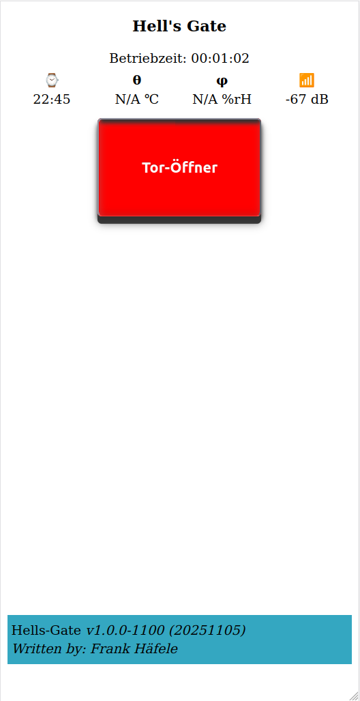

# ESP8266-01-Hells-Gate-Installer
It is a ESP Web Tools Application which installs the Hells-Gate Door Opener on your ESP8266
normally on a ESP-01.

## Contents
* [How to Use This Project](#how-to-use-this-project)
* [Usage of the Web Tools Application](#flash-hells-gate-application)
  * [Flash the ESP](#flash-hells-gate-application)
  * [Flash Procedure](#flash-procedure)
  * [First Boot](#first-boot)
* [Pin Configuration](#pins--gpios-which-are-used)
* [License](#license)
* [Helpful Links](#helpful-links)

## How to use this Project
This project can typically used as a door opener for a garage.

a) The ESP can identify the state of the door normally by a reed contactor, if the door is closed the button gets green to signalize Door is closed.

b) If you press the button the relais closes about 800 ms and the motor starts to move. If the Door leaves the the reed contactor the button gets red to signalize a not closed door.

It is the same procedure than you push the button in your garage.

## Installation via ESP Web Tools Application
The installation is pretty simple.
You click on the link in the chapter [Web-Installer](#flash-hells-gate-application) below, then you will be redirected to my web site were the ESP Web Tools will flash your ESP via browser.

## Flash Hells-Gate Application

[Web-Installer](https://hasenradball.github.io/ESP8266-01-Hells-Gate-Installer/)

### Flash Procedure
1) Press connect button

2) select serial port or device

3) select binary to flash, if multiple available

### First Boot
After the flash procedure restart the ESP. Then the ESP will open an access point named `gateconfig-xxyyzz`

1) connect to this access-point
2) load the web site `http://192.168.4.1`
3) You should see input fields
   
   a) Remember the hostname `gate-xxyyzz`
   b) enter `SSID` and `password`
   c) click `ok`
   d) chip will reboot.
4) the Application will be available at `http://gate-xxyyzz`

## Pins / GPIOs which are used
| PIN     | Biasing   | usage       |
| ------  | --------  | -----       |
| GPIO 0  | PullUp    |  Flash mode           |
| GPIO 1  | PullUp    |  TX         |
| GPIO 2  | PullUP    |  Door state |
| GPIO 3  | PullDown  |  Relais activation |

# License
This library is licensed under MIT [License](https://github.com/hasenradball/ESP8266-01-Hells-Gate-Installer/blob/main/LICENSE)

# Helpful Links
* [ESP8266-01-Adapter](https://esp8266-01-adapter.de)
* [ESP-01-Toröffner](https://esp8266-01-adapter.de/esp8266-01-esp-01-toroeffner/)
